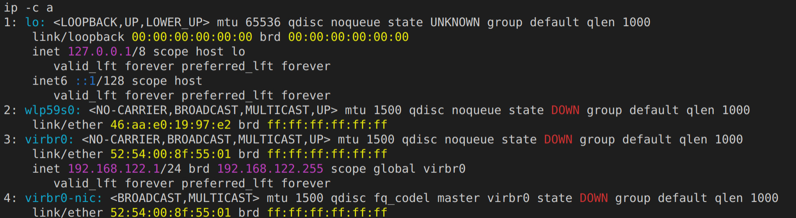

# Intro
So, my life in a short, stucked on the Airport in Zurich, and find my way out, so I finally found a shop open. Nice, now I have something to drink, but security won't open before 5:00 AM, so I have a chance to work on this finally... 6h to use for something, sleeping is overrated anyway.

In a nutshell for a long time I planned to make a summary about Linux Network tools and how to use them. It shall give you some basic overview of the possibilities, and teach you how to use the CLI to configure a Linux box.

## Basics

In a moder linux distro `ip` command is your way to go. For sentimental and historical reasons I will sometimes show how to do things in the old way or with the old tools.

Lets get through some basics, shall we?

To list your network interfaces you can do this:

```
ip link
1: lo: <LOOPBACK,UP,LOWER_UP> mtu 65536 qdisc noqueue state UNKNOWN mode DEFAULT group default qlen 1000
    link/loopback 00:00:00:00:00:00 brd 00:00:00:00:00:00
2: wlp59s0: <NO-CARRIER,BROADCAST,MULTICAST,UP> mtu 1500 qdisc noqueue state DOWN mode DORMANT group default qlen 1000
    link/ether ae:9c:4e:b6:e0:72 brd ff:ff:ff:ff:ff:ff
3: virbr0: <NO-CARRIER,BROADCAST,MULTICAST,UP> mtu 1500 qdisc noqueue state DOWN mode DEFAULT group default qlen 1000
    link/ether 52:54:00:8f:55:01 brd ff:ff:ff:ff:ff:ff
4: virbr0-nic: <BROADCAST,MULTICAST> mtu 1500 qdisc fq_codel master virbr0 state DOWN mode DEFAULT group default qlen 1000
    link/ether 52:54:00:8f:55:01 brd ff:ff:ff:ff:ff:ff
```

now as you can see I have some, a loopback device, a wireless, some virtual bridge and a virtual nic. Those are created by libvirtd in my case, but never mind them later you will understand better what are those.

one important feature of the `ip` command is that you can shorten things, instead of link you can say "l" or "li" or even "lin". Try it!

Lets see the ip addresses assigned to these interfaces:

```
ip a
1: lo: <LOOPBACK,UP,LOWER_UP> mtu 65536 qdisc noqueue state UNKNOWN group default qlen 1000
    link/loopback 00:00:00:00:00:00 brd 00:00:00:00:00:00
    inet 127.0.0.1/8 scope host lo
       valid_lft forever preferred_lft forever
    inet6 ::1/128 scope host 
       valid_lft forever preferred_lft forever
2: wlp59s0: <NO-CARRIER,BROADCAST,MULTICAST,UP> mtu 1500 qdisc noqueue state DOWN group default qlen 1000
    link/ether ae:9c:4e:b6:e0:72 brd ff:ff:ff:ff:ff:ff
3: virbr0: <NO-CARRIER,BROADCAST,MULTICAST,UP> mtu 1500 qdisc noqueue state DOWN group default qlen 1000
    link/ether 52:54:00:8f:55:01 brd ff:ff:ff:ff:ff:ff
    inet 192.168.122.1/24 brd 192.168.122.255 scope global virbr0
       valid_lft forever preferred_lft forever
4: virbr0-nic: <BROADCAST,MULTICAST> mtu 1500 qdisc fq_codel master virbr0 state DOWN group default qlen 1000
    link/ether 52:54:00:8f:55:01 brd ff:ff:ff:ff:ff:ff
```

Perfect, two more things to mention here, one by default you get IPv4 (at the time being), if you want to see IPv6 information you can use the `-6` switch:

```
ip -6 address
1: lo: <LOOPBACK,UP,LOWER_UP> mtu 65536 state UNKNOWN qlen 1000
    inet6 ::1/128 scope host 
       valid_lft forever preferred_lft forever
```

`ip` comes with a very nice colorful output if your terminal supports it, some distros this is the default behavior others requires you to use the `-c` option



Nice!

Back to the basics, lets say you want to shut down one of the interfaces, on L2, the always easy target loopback device is there for us.

To confirm your loopback device works:

```
ping 127.0.0.1
PING 127.0.0.1 (127.0.0.1) 56(84) bytes of data.
64 bytes from 127.0.0.1: icmp_seq=1 ttl=64 time=0.084 ms
64 bytes from 127.0.0.1: icmp_seq=2 ttl=64 time=0.064 ms
64 bytes from 127.0.0.1: icmp_seq=3 ttl=64 time=0.036 ms
64 bytes from 127.0.0.1: icmp_seq=4 ttl=64 time=0.072 ms
64 bytes from 127.0.0.1: icmp_seq=5 ttl=64 time=0.069 ms
64 bytes from 127.0.0.1: icmp_seq=6 ttl=64 time=0.065 ms
64 bytes from 127.0.0.1: icmp_seq=7 ttl=64 time=0.080 ms
64 bytes from 127.0.0.1: icmp_seq=8 ttl=64 time=0.083 ms
64 bytes from 127.0.0.1: icmp_seq=9 ttl=64 time=0.073 ms
64 bytes from 127.0.0.1: icmp_seq=10 ttl=64 time=0.070 ms
^C
--- 127.0.0.1 ping statistics ---
10 packets transmitted, 10 received, 0% packet loss, time 224ms
rtt min/avg/max/mdev = 0.036/0.069/0.084/0.015 ms
```

As expected right? Now bring it down:

```
sudo ip link set lo down
```

(You need to be someone to mess with network interfaces :) ), so lets see the status now:

```
ping 127.0.0.1 -w 1
PING 127.0.0.1 (127.0.0.1) 56(84) bytes of data.

--- 127.0.0.1 ping statistics ---
1 packets transmitted, 0 received, 100% packet loss, time 0ms
```

(Little side note, hopefully you have some idea what PING is, if not it is really time to do a search, in a nutshell it uses ICMP protocol to check connection between two network points. (ICMP is on L3) -> and if you don't know the network layers, really good time to search OSI Layers too.)

As expected, we can't don't get answer anymore, as our interface is down, just to confirm:

```
ip l l lo
1: lo: <LOOPBACK> mtu 65536 qdisc noqueue state DOWN mode DEFAULT group default qlen 1000
    link/loopback 00:00:00:00:00:00 brd 00:00:00:00:00:00
```

Note: see how you can filter for a known interface ?

Okay, so now bring it back to life, some services may need it on your system :)

```
sudo ip l s lo up
```

Next things next on the basics, lets say you want to assign a static IP to an interface, not that rare as you would think. 

Let's add the magical `10.0.0.1/24` address to the lo interface:

```
sudo ip address add 10.0.0.1/24 dev lo
```

Again some homework, if you never heard about private ip ranges, do a favor to yourself and search it now. Plus if you have no idea what is a network mask, do search that too.

List the addresses associated to the loopback interface:

```
ip a l lo
1: lo: <LOOPBACK,UP,LOWER_UP> mtu 65536 qdisc noqueue state UNKNOWN group default qlen 1000
    link/loopback 00:00:00:00:00:00 brd 00:00:00:00:00:00
    inet 127.0.0.1/8 scope host lo
       valid_lft forever preferred_lft forever
    inet 10.0.0.1/24 scope global lo
       valid_lft forever preferred_lft forever
    inet6 ::1/128 scope host 
       valid_lft forever preferred_lft forever
```

Now this is interesting, in the old times we used a tool called ifconfig, which did not allow you to assign multiple addresses to the same interface, lets see what does it think now:

```
ifconfig lo
lo: flags=73<UP,LOOPBACK,RUNNING>  mtu 65536
        inet 127.0.0.1  netmask 255.0.0.0
        inet6 ::1  prefixlen 128  scopeid 0x10<host>
        loop  txqueuelen 1000  (Local Loopback)
        RX packets 28  bytes 2120 (2.0 KiB)
        RX errors 0  dropped 0  overruns 0  frame 0
        TX packets 28  bytes 2120 (2.0 KiB)
        TX errors 0  dropped 0 overruns 0  carrier 0  collisions 0
```

Uho, no sign of our new address, lets try to ping it:

```
ping 10.0.0.1
PING 10.0.0.1 (10.0.0.1) 56(84) bytes of data.
64 bytes from 10.0.0.1: icmp_seq=1 ttl=64 time=0.095 ms
64 bytes from 10.0.0.1: icmp_seq=2 ttl=64 time=0.071 ms
^C
--- 10.0.0.1 ping statistics ---
2 packets transmitted, 2 received, 0% packet loss, time 45ms
rtt min/avg/max/mdev = 0.071/0.083/0.095/0.012 ms
```

So it is there, guess now we have a good reason to not use ifconfig anymore.
(note: it is possible with ifconfig to assign multiple IP addresses to one physical device, but it is creating a new "link" device - so say. Never mind, use `ip` please!)

So we added a new IP address to one of our interfaces, what happened to our routing table? Lets print it out:

```
ip route list
192.168.122.0/24 dev virbr0 proto kernel scope link src 192.168.122.1 linkdown 
```

Interesting, this interface is not even related, and looks like we don't have a route for the lo device... what happens here? For now it is enough to understand that linux has more than one routing table, to list the entries related to lo device use table id 0:

```
ip route list table 0
192.168.122.0/24 dev virbr0 proto kernel scope link src 192.168.122.1 linkdown 
broadcast 10.0.0.0 dev lo table local proto kernel scope link src 10.0.0.1 
local 10.0.0.0/24 dev lo table local proto kernel scope host src 10.0.0.1 
local 10.0.0.1 dev lo table local proto kernel scope host src 10.0.0.1 
broadcast 10.0.0.255 dev lo table local proto kernel scope link src 10.0.0.1 
broadcast 127.0.0.0 dev lo table local proto kernel scope link src 127.0.0.1 
local 127.0.0.0/8 dev lo table local proto kernel scope host src 127.0.0.1 
local 127.0.0.1 dev lo table local proto kernel scope host src 127.0.0.1 
broadcast 127.255.255.255 dev lo table local proto kernel scope link src 127.0.0.1 
broadcast 192.168.122.0 dev virbr0 table local proto kernel scope link src 192.168.122.1 linkdown 
local 192.168.122.1 dev virbr0 table local proto kernel scope host src 192.168.122.1 
broadcast 192.168.122.255 dev virbr0 table local proto kernel scope link src 192.168.122.1 linkdown 
local ::1 dev lo table local proto kernel metric 0 pref medium
```

WOW! lots of entries, and my machine is not even connected now to any network!

We will talk about this and rouring tables more in the future of this document :)

Okay, so we can set links up and down, we can add static ips, how to remove them?

```
sudo ip a delete 10.0.0.1/24 dev lo
```

Simple. I like simple.

How about dynamic IPs? Well I will add it here once I found a network to connect to:

**BIG FAT TODO**

## IP namespaces - Not so basics anymore
In linux kernel, you can have some things called ip namespaces, the magic is that a namespace separates your whole network stack from an other "copy" of your network stack. Sounds crazy if you hear about it first, and I don't even pretend to understand the complexity below, but how I imagine it, you have your routing tables, ip addresses interfaces, all of these are refered by some structures in the kernel, and as the programers did a great job, now you can have more than one of this structure. 

More about the why? - Because, of containers, because of you want to test a complex network on a single machine without any hardware ... etc. Many reasons in fact. 

But lets jump into it, you will understand it better once you see it.

Lets create a new namespace:

```
sudo ip netns add test
```

Okay, so nothing happened? Lets list the namespaces:

```
ip netns
test
```

As you can see it won't list the "default" namespace. Now running commands with the namespace as a context is a bit tricky:

```
sudo ip netns exec test ip l
1: lo: <LOOPBACK> mtu 65536 qdisc noop state DOWN mode DEFAULT group default qlen 1000
    link/loopback 00:00:00:00:00:00 brd 00:00:00:00:00:00
```

Uho, looks like a recursion? No worries it gets worse. As you can see in our new namespace there is only one interface, the loopback and even it is down. Not really an issue for now.

So how this command looks like:
ip netns exec test <COMMAND to RUN "within" the namespace>

To make life easier I like to "enter" into namespaces by running a new shell with the namespace / or in the namespace:

```
sudo ip netns exec test bash
```

This will "Drop" you into a new shell, try now any IP command:

```
ip l
1: lo: <LOOPBACK> mtu 65536 qdisc noop state DOWN mode DEFAULT group default qlen 1000
    link/loopback 00:00:00:00:00:00 brd 00:00:00:00:00:00
```

**BIG FAT WARNING**: as most of the systems you have to be root to run anything in a net namespace - your shell will be with root privilages, and despite the network is spearated, the filesystems, processes are not! Be careful in this shell.

Now so you are in a namespace lovely, can't do much, as you have no network connection from this namespace yet. And the bummer one device can be only in one namespace at the time. 

Maybe before we proceed, lets create a dummy interface - so we can play with that instead of the loopback interface:

(get out from the netns shell, or open a new window, point: be in the default namespace)

```
sudo ip l add type dummy 
```

Easy huh, check the list of the interfaces, now you have a dummy0 interface:

```
ip l
1: lo: <LOOPBACK,UP,LOWER_UP> mtu 65536 qdisc noqueue state UNKNOWN mode DEFAULT group default qlen 1000
    link/loopback 00:00:00:00:00:00 brd 00:00:00:00:00:00
2: wlp59s0: <NO-CARRIER,BROADCAST,MULTICAST,UP> mtu 1500 qdisc noqueue state DOWN mode DORMANT group default qlen 1000
    link/ether f2:2b:71:24:e5:ca brd ff:ff:ff:ff:ff:ff
3: virbr0: <NO-CARRIER,BROADCAST,MULTICAST,UP> mtu 1500 qdisc noqueue state DOWN mode DEFAULT group default qlen 1000
    link/ether 52:54:00:8f:55:01 brd ff:ff:ff:ff:ff:ff
4: virbr0-nic: <BROADCAST,MULTICAST> mtu 1500 qdisc fq_codel master virbr0 state DOWN mode DEFAULT group default qlen 1000
    link/ether 52:54:00:8f:55:01 brd ff:ff:ff:ff:ff:ff
5: dummy0: <BROADCAST,NOARP> mtu 1500 qdisc noop state DOWN mode DEFAULT group default qlen 1000
    link/ether ea:d1:76:17:3d:5e brd ff:ff:ff:ff:ff:ff
```

As the name kind of predicts it, dummy is not really up for anything, does not connceted to any hardware and well does not do much, but we can abuse it with all the kind of commands we just learned, you can assign IP address to it and so on. Most importantly for our main topic in this section, you can move it into an other namespace:

```
sudo ip l s dummy0 netns test
```

if you list now the interfaces in the default namespace:

```
ip l
1: lo: <LOOPBACK,UP,LOWER_UP> mtu 65536 qdisc noqueue state UNKNOWN mode DEFAULT group default qlen 1000
    link/loopback 00:00:00:00:00:00 brd 00:00:00:00:00:00
2: wlp59s0: <NO-CARRIER,BROADCAST,MULTICAST,UP> mtu 1500 qdisc noqueue state DOWN mode DORMANT group default qlen 1000
    link/ether b2:67:19:5c:c2:4e brd ff:ff:ff:ff:ff:ff
3: virbr0: <NO-CARRIER,BROADCAST,MULTICAST,UP> mtu 1500 qdisc noqueue state DOWN mode DEFAULT group default qlen 1000
    link/ether 52:54:00:8f:55:01 brd ff:ff:ff:ff:ff:ff
4: virbr0-nic: <BROADCAST,MULTICAST> mtu 1500 qdisc fq_codel master virbr0 state DOWN mode DEFAULT group default qlen 1000
    link/ether 52:54:00:8f:55:01 brd ff:ff:ff:ff:ff:ff
```

Dummy went missing, lets try to list the interfaces in our namespace:

```
sudo ip netns exec test ip l
1: lo: <LOOPBACK> mtu 65536 qdisc noop state DOWN mode DEFAULT group default qlen 1000
    link/loopback 00:00:00:00:00:00 brd 00:00:00:00:00:00
5: dummy0: <BROADCAST,NOARP> mtu 1500 qdisc noop state DOWN mode DEFAULT group default qlen 1000
    link/ether ea:d1:76:17:3d:5e brd ff:ff:ff:ff:ff:ff
```

Hey there we have dummy! A M A Z I N G!
Now some notes again, in order to be able to toss a device into a namespace, its driver has to support this. Happened before that some wifi chipset kernel drivers / modules were not supporting this. so if you constantly fail to move something into a namespace check the kernelogs. 

As you may figured out you can delete namespaces too:

```
sudo ip netns delete test
```

if you check now the default namespace:

```
ip l
1: lo: <LOOPBACK,UP,LOWER_UP> mtu 65536 qdisc noqueue state UNKNOWN mode DEFAULT group default qlen 1000
    link/loopback 00:00:00:00:00:00 brd 00:00:00:00:00:00
2: wlp59s0: <NO-CARRIER,BROADCAST,MULTICAST,UP> mtu 1500 qdisc noqueue state DOWN mode DORMANT group default qlen 1000
    link/ether b2:67:19:5c:c2:4e brd ff:ff:ff:ff:ff:ff
3: virbr0: <NO-CARRIER,BROADCAST,MULTICAST,UP> mtu 1500 qdisc noqueue state DOWN mode DEFAULT group default qlen 1000
    link/ether 52:54:00:8f:55:01 brd ff:ff:ff:ff:ff:ff
4: virbr0-nic: <BROADCAST,MULTICAST> mtu 1500 qdisc fq_codel master virbr0 state DOWN mode DEFAULT group default qlen 1000
    link/ether 52:54:00:8f:55:01 brd ff:ff:ff:ff:ff:ff
```

dummy is not here, and we don't have the namespace anymore. Now so this is interesting right, we get rid of dummy, by deleting the namespace he lived in. I'm not 100% convinced that dummy went down as he supposed to be, but at least we don't have a way to reach him anymore, I advise to delete the interfaces before you delete the namespaces, but it is just because I don't know for sure that those are freed properly just because we deleted their home. (Anyone?)

Okay, so far we had to separated namespaces, not much of a fun, we want to build some real life like stuff right? 

Lets learn about VETH pairs.

## VETH Pairs
A VETH pair, as the name kind of reveals already, means two interfaces, and they are magically connected in the subspace. How it works? You drop anything into one of them, and it will fall out on the other end. Virtual Ethernet? (to confirm) It is like a network cable with two ends.

Lets create one:

```
sudo ip l a type veth
```

and list the interfaces:

```
ip l
1: lo: <LOOPBACK,UP,LOWER_UP> mtu 65536 qdisc noqueue state UNKNOWN mode DEFAULT group default qlen 1000
    link/loopback 00:00:00:00:00:00 brd 00:00:00:00:00:00
2: wlp59s0: <NO-CARRIER,BROADCAST,MULTICAST,UP> mtu 1500 qdisc noqueue state DOWN mode DORMANT group default qlen 1000
    link/ether 3e:0f:bd:e3:fc:07 brd ff:ff:ff:ff:ff:ff
3: virbr0: <NO-CARRIER,BROADCAST,MULTICAST,UP> mtu 1500 qdisc noqueue state DOWN mode DEFAULT group default qlen 1000
    link/ether 52:54:00:8f:55:01 brd ff:ff:ff:ff:ff:ff
4: virbr0-nic: <BROADCAST,MULTICAST> mtu 1500 qdisc fq_codel master virbr0 state DOWN mode DEFAULT group default qlen 1000
    link/ether 52:54:00:8f:55:01 brd ff:ff:ff:ff:ff:ff
6: veth0@veth1: <BROADCAST,MULTICAST,M-DOWN> mtu 1500 qdisc noop state DOWN mode DEFAULT group default qlen 1000
    link/ether 1e:0f:1e:a2:c5:f8 brd ff:ff:ff:ff:ff:ff
7: veth1@veth0: <BROADCAST,MULTICAST,M-DOWN> mtu 1500 qdisc noop state DOWN mode DEFAULT group default qlen 1000
    link/ether b6:f3:81:52:a1:2d brd ff:ff:ff:ff:ff:ff
```

Very good, as you can see the name kinda tries to help, shows which is the "other" iterface connected to the given one. Don't get confused those called `veth1 and veth0` after the `@` you just have a hint which belongs to which.

Any idea how this can be useful? 

### Exercise: Connect namespaces with VETH pairs
Before I show, try to do this now:
 - Create a VETH pair
 - Create a netns
 - Move one side of the VETH pair into the netns
 - Set a static IP on VETH0 - lets say 10.0.0.1/24
 - Set a static IP on VETH1 - lets say 10.0.0.2/24
 - Set the link up on VETHx
 - Do ping the other end

 In other words, lets connect two namespaces with a VETH pair, which you can think about as two Routers being connected with a cable, do you start to see the possibilities here?

 Hopefully you did the exercise, otherwise if you just veeery veeery lazy copy paste this one into you terminal - NOTE: Never copy paste anything into your terminal without really understanding and checking what happens there... 

 ```bash
 sudo ip netns add test
 sudo ip l add name test1 type veth peer name test2
 sudo ip l s test2 netns test
 sudo ip a a 10.0.0.1/24 dev test1
 sudo ip l s test1 up
 sudo ip netns exec test ip a a 10.0.0.2/24 dev test2
 sudo ip netns exec test ip l s test2 up
 ```

 Couple of things to observer here, one is that you can name all of the interfaces when you create a veth, the other that the "link" status of ta veth pair will be down until you setup both of them up.

 Go ahead and ping 10.0.0.2:

```bash
ping 10.0.0.2
PING 10.0.0.2 (10.0.0.2) 56(84) bytes of data.
64 bytes from 10.0.0.2: icmp_seq=1 ttl=64 time=0.095 ms
64 bytes from 10.0.0.2: icmp_seq=2 ttl=64 time=0.069 ms
^C
--- 10.0.0.2 ping statistics ---
2 packets transmitted, 2 received, 0% packet loss, time 55ms
rtt min/avg/max/mdev = 0.069/0.082/0.095/0.013 ms
``` 

So easy. For the sake of fun, I guess you connected to the internet now.
From our test namespace you won't be able to reach the internet. Straight right? If not really, lets check the routing table of the test netns:

```bash
sudo ip netns exec test ip r
10.0.0.0/24 dev test2 proto kernel scope link src 10.0.0.2 
```

No default GW, nothing else but the route for the network address we added to the interface. 

In the next chapter we will setup a NAT GW on our default namespace, so we will setup something like your home router - which connect you to the Internet. Our Default namespace will act as a router doing NAT translation towards the default interface - say so WAN, and the VETH pair will act as a cable plugged into your LAN side, and the interface in the test namespace will be our "computer". I know I know this is super simplified and so on, but this really works just as your router...

## IPTABLES - Masquared - NAT
Yet an other tool to master - if you aim to be a linux network expert - iptables. IPTables is the name of the ip filtering capacity of the kernel (anyone, is this ~ precise?). So with setting up rules, you can basically configure a firewall, and setup NAT - Network Address Translation - between two network. You can do way - way more, but this will push your iptables experience a bit forward.

There are tons and tons of good descriptions and exercises online about iptables, and how it really works behind and so on, really not my job to tell you. But lets get on with the basics. 

List the existing rules:

```
sudo iptables -S 
sudo iptables -S
-P INPUT ACCEPT
-P FORWARD ACCEPT
-P OUTPUT ACCEPT
-N FORWARD_IN_ZONES
-N FORWARD_IN_ZONES_SOURCE
-N FORWARD_OUT_ZONES
-N FORWARD_OUT_ZONES_SOURCE
-N FORWARD_direct
-N FWDI_FedoraWorkstation
-N FWDI_FedoraWorkstation_allow
-N FWDI_FedoraWorkstation_deny
-N FWDI_FedoraWorkstation_log
-N FWDO_FedoraWorkstation
-N FWDO_FedoraWorkstation_allow
-N FWDO_FedoraWorkstation_deny
-N FWDO_FedoraWorkstation_log
-N INPUT_ZONES
-N INPUT_ZONES_SOURCE
-N INPUT_direct
-N IN_FedoraWorkstation
-N IN_FedoraWorkstation_allow
-N IN_FedoraWorkstation_deny
-N IN_FedoraWorkstation_log
-N OUTPUT_direct
-A INPUT -i virbr0 -p udp -m udp --dport 53 -j ACCEPT
-A INPUT -i virbr0 -p tcp -m tcp --dport 53 -j ACCEPT
-A INPUT -i virbr0 -p udp -m udp --dport 67 -j ACCEPT
-A INPUT -i virbr0 -p tcp -m tcp --dport 67 -j ACCEPT
-A INPUT -m conntrack --ctstate RELATED,ESTABLISHED -j ACCEPT
-A INPUT -i lo -j ACCEPT
-A INPUT -j INPUT_direct
-A INPUT -j INPUT_ZONES_SOURCE
-A INPUT -j INPUT_ZONES
-A INPUT -m conntrack --ctstate INVALID -j DROP
-A INPUT -j REJECT --reject-with icmp-host-prohibited
-A FORWARD -d 192.168.122.0/24 -o virbr0 -m conntrack --ctstate RELATED,ESTABLISHED -j ACCEPT
-A FORWARD -s 192.168.122.0/24 -i virbr0 -j ACCEPT
-A FORWARD -i virbr0 -o virbr0 -j ACCEPT
-A FORWARD -o virbr0 -j REJECT --reject-with icmp-port-unreachable
-A FORWARD -i virbr0 -j REJECT --reject-with icmp-port-unreachable
-A FORWARD -m conntrack --ctstate RELATED,ESTABLISHED -j ACCEPT
-A FORWARD -i lo -j ACCEPT
-A FORWARD -j FORWARD_direct
-A FORWARD -j FORWARD_IN_ZONES_SOURCE
-A FORWARD -j FORWARD_IN_ZONES
-A FORWARD -j FORWARD_OUT_ZONES_SOURCE
-A FORWARD -j FORWARD_OUT_ZONES
-A FORWARD -m conntrack --ctstate INVALID -j DROP
-A FORWARD -j REJECT --reject-with icmp-host-prohibited
-A OUTPUT -o virbr0 -p udp -m udp --dport 68 -j ACCEPT
-A OUTPUT -j OUTPUT_direct
-A FORWARD_IN_ZONES -g FWDI_FedoraWorkstation
-A FORWARD_OUT_ZONES -g FWDO_FedoraWorkstation
-A FWDI_FedoraWorkstation -j FWDI_FedoraWorkstation_log
-A FWDI_FedoraWorkstation -j FWDI_FedoraWorkstation_deny
-A FWDI_FedoraWorkstation -j FWDI_FedoraWorkstation_allow
-A FWDI_FedoraWorkstation -p icmp -j ACCEPT
-A FWDO_FedoraWorkstation -j FWDO_FedoraWorkstation_log
-A FWDO_FedoraWorkstation -j FWDO_FedoraWorkstation_deny
-A FWDO_FedoraWorkstation -j FWDO_FedoraWorkstation_allow
-A INPUT_ZONES -g IN_FedoraWorkstation
-A IN_FedoraWorkstation -j IN_FedoraWorkstation_log
-A IN_FedoraWorkstation -j IN_FedoraWorkstation_deny
-A IN_FedoraWorkstation -j IN_FedoraWorkstation_allow
-A IN_FedoraWorkstation -p icmp -j ACCEPT
-A IN_FedoraWorkstation_allow -p tcp -m tcp --dport 22 -m conntrack --ctstate NEW,UNTRACKED -j ACCEPT
-A IN_FedoraWorkstation_allow -p udp -m udp --dport 137 -m conntrack --ctstate NEW,UNTRACKED -j ACCEPT
-A IN_FedoraWorkstation_allow -p udp -m udp --dport 138 -m conntrack --ctstate NEW,UNTRACKED -j ACCEPT
-A IN_FedoraWorkstation_allow -d 224.0.0.251/32 -p udp -m udp --dport 5353 -m conntrack --ctstate NEW,UNTRACKED -j ACCEPT
-A IN_FedoraWorkstation_allow -p udp -m udp --dport 1025:65535 -m conntrack --ctstate NEW,UNTRACKED -j ACCEPT
-A IN_FedoraWorkstation_allow -p tcp -m tcp --dport 1025:65535 -m conntrack --ctstate NEW,UNTRACKED -j ACCEPT
```

Now if you see something like this - than your linux is running a firewall service for you, which may interfer with everything we try to learn here.

Very first thing to do is to turn this down for the time being.

Everything you will see here only works for Fedora, may work for other linuxes, and definitelly won't work on Ubuntu or Debian.

```bash
sudo systemctl stop firewalld
```

This will stop your firewalld service - it will restart automagically at the next reboot.

Check the iptable rules.

```bash
sudo iptables -S
-P INPUT ACCEPT
-P FORWARD ACCEPT
-P OUTPUT ACCEPT
```

If you see this, your system is nice, and did flush all the rules when you stopped the firewall. Otherwise you may need to flush them by yourself:

```bash
sudo iptables -F
```

Now hopefully you did not run that command on a production server - as it will drop your rules, and likely break a lots of things on a busy prod server. - if it is configured at all.

What do we see here is we have 3 chains, named INPUT, FORWARD and OUTPUT. Packages we receive first travel to INPUT chain, if we forward them they travel via FORWARD, and finally everything our computer sends out finishes up in OUTPUT.

You will see that the situation is more complicated, but for now live with this version.
Note: you can introduce new chains and so on.

We put rules into these chains. And they evaluated against the packages in orders from top to bottom.

Lets see an easy example. Block our ping from 10.0.0.2.

First test it is working:

```
sudo ip netns exec test ping 10.0.0.1
PING 10.0.0.1 (10.0.0.1) 56(84) bytes of data.
64 bytes from 10.0.0.1: icmp_seq=1 ttl=64 time=0.040 ms
64 bytes from 10.0.0.1: icmp_seq=2 ttl=64 time=0.059 ms
^C
--- 10.0.0.1 ping statistics ---
2 packets transmitted, 2 received, 0% packet loss, time 62ms
rtt min/avg/max/mdev = 0.040/0.049/0.059/0.011 ms
```

Hopefully same for you.

Now lets block it.  

```bash
sudo iptables -A INPUT -p icmp -s 10.0.0.2 -j DROP
```

And try to ping now:

```
sudo ip netns exec test ping 10.0.0.1
PING 10.0.0.1 (10.0.0.1) 56(84) bytes of data.
^C
--- 10.0.0.1 ping statistics ---
5 packets transmitted, 0 received, 100% packet loss, time 98ms
```

Just as we wanted. Lets see what we have done?

```
sudo iptables
 -A INPUT #So the new rule is for the INPUT chain
 -p icmp  #The protocol is icmp, if you don't know what is that, gooogle now.
 -s 10.0.0.2 #The source ip is 10.0.0.2
 -j DROP  #Jump to DROP "chain" (anyone is this right?), which means we just drop the package
```

in human words, we setup a rule to drop all icmp packages from 10.0.0.2. Perfect right?
It is not visible from here, but we have multiple tables too, if not defined we talk about the default table. 
Now what we would like to do, is to remove this example rule first:

```
sudo iptables -D INPUT -p icmp -s 10.0.0.2 -j DROP
sudo ip netns exec test ping 10.0.0.1
PING 10.0.0.1 (10.0.0.1) 56(84) bytes of data.
64 bytes from 10.0.0.1: icmp_seq=1 ttl=64 time=0.025 ms
64 bytes from 10.0.0.1: icmp_seq=2 ttl=64 time=0.066 ms
```

Perfect, works as expected. Now you learnt how to delete a rule.

Lets proceed something more advanced, iptables can do NAT for us. Lets setup a simple NAT rule, packages coming from test namespace shall be forwarded to the Internet. iptables is stateful, so our reply packages will find their ways back too. (is this really true or only for NAT?)

```bash
sudo iptables -t nat -A POSTROUTING -o enp0s3 -j MASQUERADE
```

Lets see if this did the magic?

```bash
sudo ip netns exec test ping 8.8.8.8
connect: Network is unreachable
```

Nope, no internet yet (if you don't know 8.8.8.8 is a DNS server of google)
What is missing? -> try to find out before you read on :)


So ofcourse we haven't fixed the routing table of the test namespace, there is no default route or gateway defined. The iptables command above setup NAT towards my main interface, but the namespace does not know about this, lets add the missing route:

```bash
sudo ip netns exec test ip route add 0.0.0.0/0 dev test2 via 10.0.0.1
```

Check the routing table now:

```bash
sudo ip netns exec test ip route
default via 10.0.0.1 dev test2 
10.0.0.0/24 dev test2 proto kernel scope link src 10.0.0.2 
```

Great we have a default route with a gateway defined. Lets see if the ping works now...

```bash
sudo ip netns exec test ping 8.8.8.8
PING 8.8.8.8 (8.8.8.8) 56(84) bytes of data.
64 bytes from 8.8.8.8: icmp_seq=1 ttl=120 time=51.9 ms
64 bytes from 8.8.8.8: icmp_seq=2 ttl=120 time=41.8 ms
64 bytes from 8.8.8.8: icmp_seq=3 ttl=120 time=50.9 ms
64 bytes from 8.8.8.8: icmp_seq=4 ttl=120 time=48.6 ms
64 bytes from 8.8.8.8: icmp_seq=5 ttl=120 time=46.2 ms
^C
--- 8.8.8.8 ping statistics ---
5 packets transmitted, 5 received, 0% packet loss, time 10ms
rtt min/avg/max/mdev = 41.789/47.890/51.909/3.629 ms
```

Worked for me, may not work for you, one more important aspect to check if the port forwarding is enabled at all in the kernel settings, lets take a peak:

```bash
sysctl -a | grep ip_forward
net.ipv4.ip_forward = 1
net.ipv4.ip_forward_update_priority = 1
net.ipv4.ip_forward_use_pmtu = 0
```

If you see the ipv4.ip_forward = 1 you good to go, otherwise you want to setup it, do a google search about sysctl and ip_forwarding to learn how to mess with these settings.

All in all mission is accomplished, but we are far from secure and we will do now NAT for all the interfaces, not really a good habit, so please do some reasearch, add rules like -A FORWARD -s x.x.x.x/x -i <namespace interface> -o <output interface> -J ACCEPT, and change the default behaviour to "DROP" with -t nat -P POSTROUTING DROP. **NOTE**: Be careful with drop if you work on a remote machine over SSH, you can easily lock yourself out ;)

Sorry for not giving more on iptables but that's a book of its own, and we have maaany soo good books on it. Do a favor to yourself and get one.

## Bridges

So in the next time, we will check how to connect two different namespace via a bridge, which is a L2 connection between two or more interfaces!

Stay tunned :)

